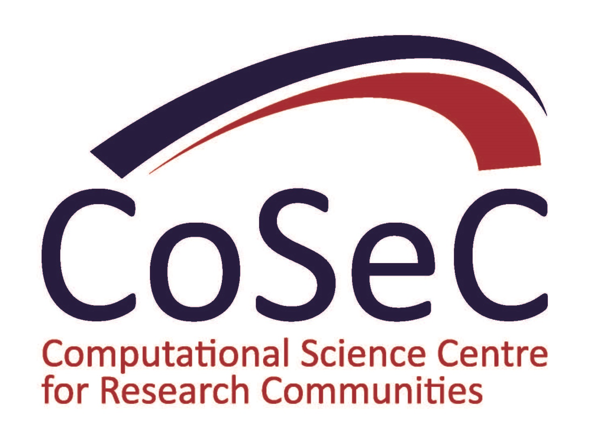

Longbow Documentation
**************************

**Longbow is a lightweight, simple and intuitive remote job submission utility.**

The philosophy behind Longbow is that it should be easy to run simulations on a High Performance Computing (HPC) machine from your desktop and have the results delivered on a plate. No more SSH, writing job submission scripts, SFTP, ...

Longbow is geared towards lowering the barriers surrounding simulation with HPC resources for non-traditional users and early-career scientists.

Longbow works by creating job submission scripts for you, these are customised for the job scheduling system of the HPC machine you wish to use. Longbow sends this script and input files from the local working directory of your desktop computer to the remote HPC machine; and subsequently submits the job. Whilst the job is running, Longbow can periodically bring the results back to your local computer, bringing the power of HPC to your desktop...

Licensing
+++++++++

Longbow is released under the BSD 3-clause license. A copy of this license is provided when Longbow is downloaded and installed.
 
Citing
++++++

If you make use of Longbow in your own code or in production simulations that result in publishable output, then please reference our paper:

Gebbie-Rayet, J, Shannon, G, Loeffler, H H and Laughton, C A 2016 Longbow: A Lightweight Remote Job Submission Tool. Journal of Open Research Software, 4: e1, DOI: http://dx.doi.org/10.5334/jors.95

.. _support:

Support
+++++++

Support for any issues arising from using Longbow, whether these are questions, to report a bug or to suggest new ideas. You should use the Longbow issue tracker here: https://github.com/HECBioSim/Longbow/issues

.. toctree::
   :maxdepth: 2
   :caption: User Documentation:

   usr-installation
   usr-getting-started
   usr-configuration
   usr-running-jobs
   usr-troubleshooting

.. toctree::
   :maxdepth: 2
   :caption: API Documentation:

   api-longbow
   api-longbow.apps
   api-longbow.schedulers

.. toctree::
   :maxdepth: 2
   :caption: Developers Documentation:

   dev-integrating
   dev-plugins
   dev-contributing
   dev-documenting
   dev-testing

Longbow has been brought to you by a collaboration between STFC and Nottingham university through the HECBioSim consortium (a part of CoSeC).

.. image:: images/stfc.jpg
    :width: 32%
    :target: https://stfc.ukri.org

