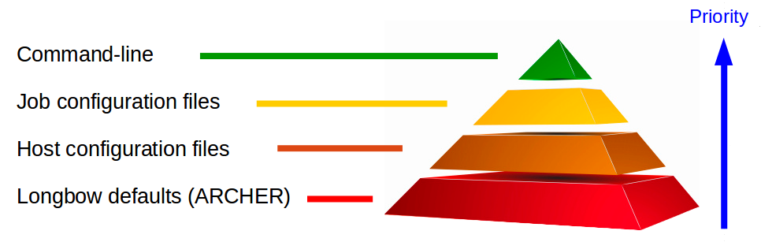

Longbow Configuration
*********************

**This section explains how to best make use of Longbow parameters.**

To communicate, copy files and submit jobs on a remote resource, Longbow needs to be supplied with the details of the HPC machine. Also, to automatically create a job submission script to your specification, Longbow also needs to be supplied with details of the job such as the executable to run or the number of cores to use. In this documentation, these pieces of information are referred to as **parameters**.

There are a number of ways that you can feed Longbow with these parameters, this section of documentation will explain in detail the ways and also the kinds of parameters that can be supplied to Longbow.

Basic Principles of Configuration
=================================

Longbow has been designed to be extremely flexible in terms of configuration, to keep things simple we have maintained a well-defined system of configuration that will assimilate information from a number of different sources. You are not limited to providing all parameters from one source either.

This means that you can use a combination of input sources for such purposes as representing complex configuration patterns (facility specific configuration differences, or job type differences) or simply for the convenience of having a base configuration for quick job submission but that can be overridden easily if necessary. 

There are several sources from which Longbow will bring in configuration parameters, these are the command-line, job configuration files, host configuration files and Longbow internal defaults. Longbow will load up all parameters from these sources and then for each parameter make a decision which one to use based upon a simple but structured hierarchy of priority. 

This order of priority is outlined in the following diagram, it can be seen that the command-line has the highest priority. This means that a given parameter on the command-line would override any value provided for this parameter from any of the other sources.

    A diagrammatic representation of the order of priority that the Longbow parameterisation streams take.

Although Longbow has this well defined structure, not every parameter can be provided in each configuration source. For example, only a subset of the total set of parameters may be given on the command-line. For obvious reasons, there are not Longbow defaults for every single parameter either. This means that the user does have to provide certain information as a requirement in certain sources (for example the host file is always required). The following sections will discuss this in detail.

The command-line
================

Provided that at least the host configuration file has been configured (**instructions for basic setup**) with at least the minimum required parameters, simple jobs can be launched from the command-line. A simple Longbow command-line looks like the following::

    longbow [longbow arguments] executable [executableargs]

The above command-line shows how a simple command-line job would be launched, the Longbow parameters should always come before the executable and it's arguments. So looking at the first half of the Longbow command-line above, it is well known that you will use the program executable name first in the command-line (in this case "longbow").

The "longbow arguments" are how we configure Longbow from the command-line, we do this by providing flags for Longbow to look for. There are two categories of flags, those that aren't related to running jobs (such as --help) and those that are explicitly related to running jobs (such as --replicates).

Starting with command-line flags that are not related to running jobs we have

--about 	This flag will output information about Longbow to the console terminal.

--examples 	This flag will download the Longbow example set, you can control where these are placed by navigating in your terminal to the desired location before launching.

--help 	        This flag will output the Longbow help to the console, this is useful for quick command-line flag look-up.

--version 	This flag will output the current version of Longbow that is installed on your system.

The above command-line flags are designed to be run alone, not in conjunction with any other flags. They will typically perform the function described above and then Longbow will exit. An example of running with one of the above flags, would be to query which version of Longbow is installed on your machine, to do this one simply opens a terminal and types::

    longbow --version

The following list constains the command-line flags that are explicitly related to running jobs

--debug         This flag will trigger the output of debugging information to both your log file and the console terminal. Should only be used when requesting support.

--disconnect    This flag will activate dis-connect mode **link**.

--hosts         [/path/to/file]

                This flag will make Longbow use the host file and path specified and not the default ~/.longbow/host.conf. If only a file name is given and not a full path then longbow will search the current working directory and then the ~/.longbow directory in that order for the named file, it will use the first one it discovers.

--job           [/path/to/file]

                This flag will make Longbow look for and load parameters from a job configuration file. Note that a job configuration file is not strictly necessary to use Longbow. If the filename is provided but not the path, Longbow will search in the directory that you launch your experiment from (the current working directory) and then the directory in which the longbow executable resides if necessary. There is no default filename that is assumed for the the job configuration file.

--jobname       [jobname]

                This flag will set the job name. This will NOT override the same parameters in configuration files making it an exception to the usual parameter hierarchy.
--log           [/path/to/file] 

                This flag is set then the log file will be written to the specified path. If the filename is provided, but not the path, the file will be output to the current working directory. If this flag is not included, a default file called log will be output to the current working directory.

--maxtime       [HH:MM]

                This flag will override the walltime for each job.
--nochecks      This flag will disable checks that are performed on the application availability on the remote HPC machine. This is for cases where the path the the executable is too complex, such that Longbow has a hard time trying to find it but you are certain that it should work.

--recover       [/path/to/file]

                This flag will start the recovery of a failed or disconnected Longbow session. Longbow will save recovery files into the ~/.longbow directory with a date and time stamp in the file name, you should supply the path to this file to initiate the recovery and continuation of the session **link**

--resource      [resource name]

                This flag specifies which HPC machine in the host configuration file to send the job to. This will overrule the same parameters in any configuration files.

--replicates    [number]

                This flag specifies the number of replicate jobs to run. This will overrule the same parameters in any configuration files.

--verbose       This flag, will turn on logging to the console terminal in addition to the log file, this is useful in cases where you are running Longbow on a desktop computer and wish to monitor the progress live rather than from file. Longbow is set to only log to file by default, so that it can be used in conjunction with local batch queue systems without duplicate output.

Now we have seen the Longbow configuration side of the command-line all that remains is the executable side of the command-line::

    longbow [longbow arguments] executable [executableargs]

This is simply the command-line of the program that you would normally use if you were not using it in conjunction with Longbow. In the above example the parameter "executable" can be one of pmemd, pmemd.MPI, charmm, namd2, mdrun, mdrun_d, mdrun_mpi, mdrun_mpi_d, lmp_xc30 (Longbow can be extended to work with other software **link**). The parameter "executableargs" should be replaced with the arguments that you wish to supply to your MD program, for example

for charmm::

    "<" example.inp ">" output 

or for amber::

    -i example.in -c example.min -p example.top -o output for Amber

The executableargs must immediately follow the executable on the Longbow command line. So putting all of this together, we saw in the **Running Longbow Examples** section an example of the executable and executableargs parameters being provided on the longbow command line. The example below is similar but demonstrates how the user can specify which remote resource to use using the --resource flag::

    longbow --resource archer-short --replicates 5 --jobname TestJob pmemd.MPI -O -i test.in -c test.min -p test.top -o test.out

Longbow will submit the replicate job named "TestJob" to ARCHER. If a job is submitted without a job configuration file and also without the --jobname flag being set then the job name will default to "Longbowjob" and will show up as such if you query the batch queue system of the remote resource.

The Job Configuration File
==========================

Compared to the host configuration file (discussed in the next part), the job configuration file is designed to be changed frequently, perhaps for each job submitted. The idea is that the job configuration file will overrule parameters in the host configuration file on a parameter by parameter basis. For example, A user might have a large set of jobs that fit into different categories of resource requirement (small, medium and large), this user could then have generic job configuration files to setup the number cores and wall time requirements of those three categories of job. The job configuration file allows the user to overrule parameters listed in the host configuration file.

A job configuration file is not necessarily needed as demonstrated in the **Running Longbow Examples** section of this guide. However, not all parameters that may change on a job by job basis can be provided on the command line, and the user may not wish to change the defaults they have specified in the host configuration file. The job configuration file was introduced to deal with such issues or prevent the need for writing lengthy commands such as::

    longbow --cores 48 --maxtime 96:00 --memory 20 --polling-frequency 60 pmemd.MPI -i example.in -c example.min -p example.top -o output

Instead, these parameters can be provided in the job configuration file like this::

    [example]
    resource = Archer
    maxtime = 01:00
    cores = 48
    polling-frequency = 120
    remoteworkdir = /work/myproject/myproject/myusername/longbow

Where the jobname appears within the square brackets "[ ]" and each parameter and value is listed under this jobname. Multiple jobs can be specified by including multiple sections, each starting with a jobname and then listing its parameters (more on this here **link**). Once the job configuration file has been prepared the above command-line shrinks down to::

    longbow --job /path/filename

If the filename is provided but not the path, Longbow will search in the (local) directory that you launch your experiment from (i.e. the working directory on your desktop) and then the directory in which the longbow executable resides if necessary. There is no default filename that is assumed for the the job configuration file unlike with the host configuration file.

Upon launch, the above job would run on Archer in /work/myproject/myproject/myusername/longbow/exampleXXXXX where XXXXX represents a generated 5-digit number. You see, the remoteworkdir parameter in the the job configuration file would overrule that in the host configuration file. Note that the name of the job "example" is used as the subdirectory of remoteworkdir in which the job runs only with a random 5-digit number appended on the end. These random numbers are appended for all jobs regardless of the configuration methods used, this is to prevent jobs of the same name clashing on the remote resource.

Any parameter listed in the **parameters** section can be included in the job configuration file with the exception of host and user because these are strongly tied to the HPC resource rather than the job.

The Host Configuration File
===========================

The host configuration file is designed to be a reasonably static entity which contains the details to access remote HPC machines. In addition, any **parameters** the user deems would not change across jobs but across hosts or those that hardly change would be a good candidate to appear with the hosts.

Upon installing Longbow, a default host configuration file is created in the ~/.longbow/hosts.conf file and as such the --hosts longbow argument flag needn't be provided if you are using this file. Many users will wish to modify this file to reflect their HPC resource(s). However, some users may wish to specify their own file using the --hosts longbow argument flag on the command line when submitting jobs::

    longbow --hosts /path/filename .....

If the filename is provided but not the path, Longbow will search in the directory that you launch your experiment from (i.e. the working directory), then the directory the longbow executable is stored and then the ~/.longbow directory.

The host configuration file is structured in the below format which consists of sections in square brackets (Longbow uses this as the name of the HPC machine) followed by a list of named parameters and their values::

    [Archer]
    host = login.archer.ac.uk
    user = myusername
    remoteworkdir = /work/myproject/myproject/myusername/
    account = myproject-Surname

Any parameter listed in the **parameters** section below can be included in the host configuration file with the exception of the parameter "resource". There are three parameters that must be included in the host configuration file otherwise an error will occur, these are

user
host
remoteworkdir

Of these three, only remoteworkdir can be also supplied in the job configuration file. Due to the hierarchy of parameters, if remoteworkdir, or any other common parameter is specified in both, the value in the job configuration file will be preferentially selected.

On a final note, if Longbow is not told which remote resource to submit jobs to using the --resource flag on the command line or parameter of the same name in the job configuration file, Longbow will default to submitting jobs to the HPC machine that appears first in the host configuration file.

List of Configuration File Parameters
=====================================

This section contains a list of parameters that may be used in either of the host or job configuration files, a small selection however should only be used in the host configuration file.

+-------------------+------------------------------------------------------------------------------------------------------------------------+ 
| account           | If the HPC machine requires an account code (ARCHER does) supply it using this parameter or else jobs may be rejected. |
+-------------------+------------------------------------------------------------------------------------------------------------------------+
| accountflag       | Sometimes system administrators for whatever reason decide that they need to change the default for the account        |
|                   | directive option. If this is the case then the user can specify what Longbow should supply with this parameter.        |
|                   | Longbow defaults to -A for PBS, SGE and SLURM but for LSF will default to -P.                                          |
+-------------------+------------------------------------------------------------------------------------------------------------------------+
| cores             | The total number of cores to request.                                                                                  |
+-------------------+------------------------------------------------------------------------------------------------------------------------+
| corespernode      | This parameter is important for Longbow to be be able to properly resource jobs and should be provided for all         |
|                   | machines. Longbow has an internal default of 24 cores per node as this is currently a common configuration, however if |
|                   | the machine you are using differs then you should set it using this parameter in your host configuration file. You can |
|                   | normally find this information from the hardware section of your HPC machine webpages or ask their support staff.      |
+-------------------+------------------------------------------------------------------------------------------------------------------------+
| download-include  | Exposes the rsync --include flag for downloads, these flags are used to get fine grained control over what is          |
|                   | transferred using rysnc. Users should specify a comma separated list of files to include whilst simultaneously setting |
|                   | the download exclude parameter to all (download-exclude = \*) when making use of this parameter.                       |
+-------------------+------------------------------------------------------------------------------------------------------------------------+
| download-exclude  | Exposes the rsync --exclude flag for downloads, these flags are used to get fine grained control over what is          |
|                   | transferred using rysnc. Users should either specify a comma separated list of files (black-listing) they wish to      |
|                   | exclude from the download staging or set to all "*" in conjunction with providing a list of files to the               |
|                   | download-include parameter listed above (white-listing).                                                               |
+-------------------+------------------------------------------------------------------------------------------------------------------------+
| email-address     | This parameter allows the user to set an email address that will be written into the job submission script so that the |
|                   | scheduler can send an email on job completion.                                                                         |
+-------------------+------------------------------------------------------------------------------------------------------------------------+
| email-flags 	    | This parameter allows the user to set the email flags that tell the scheduler how you want to receive emails about     |
|                   | running jobs. You should use the format that you normally use in your job submission scripts ie PBS "email-flags = b"  |
|                   | or for SGE "email-flags = beas".                                                                                       |
+-------------------+------------------------------------------------------------------------------------------------------------------------+
| executable        | The name of the executable to use on the HPC machine. Using this argument in conjunction with executableargs parameter |
|                   | is a good way of avoiding having to write long command-lines. A list of executables supported out of the box is:       |
|                   |                                                                                                                        |
|                   | +-------------+---------------------------------------------------------+                                              |
|                   | | **Package** | **Executables**                                         |                                              |
|                   | +-------------+---------------------------------------------------------+                                              |
|                   | | AMBER       | pmemd pmemd.MPI pmemd.cuda                              |                                              |
|                   | +-------------+---------------------------------------------------------+                                              |
|                   | | CHARMM      | charmm charmm_mpi charmm_cuda                           |                                              |
|                   | +-------------+---------------------------------------------------------+                                              |
|                   | | GROMACS     | gmx gmx_d mdrun mdrun_d mdrun_mpi mdrun_mpi_d           |                                              |
|                   | +-------------+---------------------------------------------------------+                                              |
|                   | | LAMMPS      | lmp_xc30 lmp_linux lmp_gpu lmp_mpi lmp_cuda lmp         |                                              |
|                   | +-------------+---------------------------------------------------------+                                              |
|                   | | NAMD        | namd2 namd2.mpi namd2.cuda                              |                                              |
|                   | +-------------+---------------------------------------------------------+                                              |
|                   |                                                                                                                        |
|                   | New programs and/or executables can be added by following this guide **link**                                          |
+-------------------+------------------------------------------------------------------------------------------------------------------------+  
| executableargs    | As an alternative to providing the arguments for the MD package on the Longbow command-line, these arguments can be    |
|                   | specified in a configuration file.                                                                                     |
|                   |                                                                                                                        |
|                   | For example, a NAMD job could be submitted on your local machine in the following fashion::                            |
|                   |                                                                                                                        |
|                   |     longbow --verbose namd2 "<" example.in                                                                             |
|                   |                                                                                                                        |
|                   | An equivalent way to submit this job would be to specify the arguments in the job configuration file, job.conf::       |
|                   |                                                                                                                        |
|                   |     [myjob]                                                                                                            |
|                   |     ..                                                                                                                 |
|                   |     executable = namd2                                                                                                 |
|                   |     executableargs = example.in                                                                                        |
|                   |     ..                                                                                                                 |
|                   |                                                                                                                        |
|                   | and then use the following command::                                                                                   |
|                   |                                                                                                                        |
|                   |     longbow --verbose --job job.conf                                                                                   |
+-------------------+------------------------------------------------------------------------------------------------------------------------+
| handler           | This parameter enables users to specify the name of the job handler that should be used to run the parallel MD job     |
|                   | (e.g. mpirun, aprun etc). If this parameter is not included, the code will automatically try to determine which        |
|                   | handler is present on the HPC machine. A minority of users may wish to provide additional arguments to the executable  |
|                   | (e.g. -np for mpirun) and can do so using this parameter. Simply use for example::                                     |
|                   |                                                                                                                        |
|                   |     [Archer]                                                                                                           |
|                   |     ..                                                                                                                 |
|                   |     handler = mpirun -np 16                                                                                            |
|                   |     ..                                                                                                                 |
|                   |                                                                                                                        |
|                   | **Note**, that for the aprun handler, the -n and -N flags are provided by default by Longbow.                          |
+-------------------+------------------------------------------------------------------------------------------------------------------------+
| host 	            | The address of the HPC machine. For example login.archer.ac.uk                                                         |
+-------------------+------------------------------------------------------------------------------------------------------------------------+
| localworkdir      | Path to the directory on the desktop from which the job should be run if this should not be the current working        |
|                   | directory. This is optional and will override where the input files required for the MD job are to be found and where  |
|                   | the results files should be directed to (most users should ignore this unless there is a good reason).                 |
+-------------------+------------------------------------------------------------------------------------------------------------------------+
| lsf-cluster       | For users of HPC machines that run an LSF scheduler, the cluster the job should be submitted to can be specified with  |
|                   | this parameter.                                                                                                        |
+-------------------+------------------------------------------------------------------------------------------------------------------------+
| modules           | The modules to be loaded on the remote resource using the "module load" command. A comma separated list can be entered |
|                   | here if multiple modules are required. For example, if you would normally have the following lines in your submission  |
|                   | script::                                                                                                               |
|                   |                                                                                                                        |
|                   |     module load intel-mpi                                                                                              |
|                   |     module load charmm                                                                                                 |
|                   |                                                                                                                        |
|                   | simply include the following in the job configuration file::                                                           |
|                   |                                                                                                                        |
|                   |     modules = intel-mpi, charmm                                                                                        |
|                   |                                                                                                                        |
|                   | If the modules parameter isn't specified, Longbow will try assume which modules are required according to the          |
|                   | executable name. However, this only works if the executable supplied is supported by a plugin. Out of the box the      |
|                   | following executables map onto the following module names by default                                                   |
|                   |                                                                                                                        |
|                   | +------------------------------------------------------+------------+                                                  |
|                   | | **Executable**                                       | **Module** |                                                  |
|                   | +------------------------------------------------------+------------+                                                  |
|                   | | pmemd, pmemd.MPI, pmemd.cuda                         | amber      |                                                  |
|                   | +------------------------------------------------------+------------+                                                  |
|                   | | charmm, charmm_mpi, charmm_cuda                      | charmm     |                                                  |
|                   | +------------------------------------------------------+------------+                                                  |
|                   | | gmx, gmx_d, mdrun, mdrun_d, mdrun_mpi, mdrun_mpi_d   | gromacs    |                                                  |
|                   | +------------------------------------------------------+------------+                                                  |
|                   | | lmp, lmp_xc30, lmp_linux, lmp_gpu, lmp_mpi, lmp_cuda | lammps     |                                                  |
|                   | +------------------------------------------------------+------------+                                                  |
|                   | | namd2, namd2.mpi, namd2.cuda                         | namd       |                                                  |
|                   | +------------------------------------------------------+------------+                                                  |
+-------------------+------------------------------------------------------------------------------------------------------------------------+
| maxtime           | Maximum wall clock time, this will be used to tell the scheduler how long the job should last and will likely be       |
|                   | kicked out of the queue if it overruns. This should be given in the format "HH:MM". Longbow will automatically add     |
|                   | zero seconds onto your entry if your scheduler requires the format "HH:MM:SS".                                         |
+-------------------+------------------------------------------------------------------------------------------------------------------------+
| memory            | Integer representing the number of GB to be assigned to the scheduler memory directive in your submit script.          |
+-------------------+------------------------------------------------------------------------------------------------------------------------+
| mpiprocs          | Allows undersubscription or to change mpiprocs freely without hacking the corespernode parameter. This is often needed |
|                   | to properly run LAMMPS SMP builds.                                                                                     |
+-------------------+------------------------------------------------------------------------------------------------------------------------+
| polling-frequency | The interval for Longbow to query the status of a job/s, this is given in seconds and should not be set too small      |
|                   | (not less than 60) otherwise the system admins may not like you.                                                       |
+-------------------+------------------------------------------------------------------------------------------------------------------------+
| port              | The port number if the remote resource is using an unusual port for ssh, Longbow defaults to 22 if nothing is given.   |
+-------------------+------------------------------------------------------------------------------------------------------------------------+
| queue             | The queue the job should be submitted to on the remote resource.                                                       |
+-------------------+------------------------------------------------------------------------------------------------------------------------+
| remoteworkdir     | Name the working directory on the HPC machine. If it doesn't already exist Longbow will create it. Longbow will then   |
|                   | use remoteworkdir as its staging area, so for each job a subdirectory will be created by Longbow in which the job will |
|                   | run.                                                                                                                   |
+-------------------+------------------------------------------------------------------------------------------------------------------------+
| replicates        | Number of desired replicates for job arrays (**see the Running Jobs section**).                                        |
+-------------------+------------------------------------------------------------------------------------------------------------------------+
| replicate-naming  | Users that wish to have different naming prefix for replicate directories than the default of rep1, rep2, rep3, ...    |
|                   | can supply something like this in their configuration scripts::                                                        |
|                   |                                                                                                                        |
|                   |    replicate-naming = run                                                                                              |
|                   |                                                                                                                        |
|                   | and this will result in the directories run1, run2, run3, ... getting used.                                            |
+-------------------+------------------------------------------------------------------------------------------------------------------------+
| resource          | This specifies the name of the HPC machine to use, which refers to the name given within the square brackets [] in the |
|                   | host configuration file.                                                                                               |
+-------------------+------------------------------------------------------------------------------------------------------------------------+
| scheduler         | This is the name of the job scheduling environment (PBS/LSF/SGE/SoGE/SLURM) this can be used to force Longbow to use   |
|                   | the logic for a given scheduler if the internal tests run by Longbow are struggling to identify the setup for your HPC |
|                   | machine.                                                                                                               |
|                   |                                                                                                                        |
|                   | Please note, if using Son of Grid Engine (SoGE) or Sun Grid Engine (SGE) the autodetection is unable to distinguish    |
|                   | between them. It is best to just add the scheduler = SGE or scheduler = SoGE to your hosts.conf                        |
+-------------------+------------------------------------------------------------------------------------------------------------------------+
| scripts           | This parameter is for including scripts in the job submission script written by Longbow. The script/s must already be  |
|                   | present on the HPC machine, Longbow will not transfer these for you, so any paths must be valid for the script path on |
|                   | the HPC machine.                                                                                                       |
|                   |                                                                                                                        |
|                   | An example of using this in a configuration file is to include the Linux module initialisation script::                |
|                   |                                                                                                                        |
|                   |     scripts = source /etc/profile.d/modules.sh                                                                         |
|                   |                                                                                                                        |
|                   | and this will append this line into your job submission file like this::                                               |
|                   |                                                                                                                        |
|                   |     #!/bin/bash --login                                                                                                |
|                   |     #$ -cwd -V                                                                                                         |
|                   |     #$ -N single                                                                                                       |
|                   |     #$ -q gpu                                                                                                          |
|                   |     #$ -l h_rt=24:00:00                                                                                                |
|                   |                                                                                                                        |
|                   |     source /etc/profile.d/modules.sh                                                                                   |
|                   |                                                                                                                        |
|                   |     module load apps/intel/gromacs/4.6.1                                                                               |
|                   |                                                                                                                        |
|                   |     mpirun mdrun -s example.tpr -deffnm output                                                                         |
|                   |                                                                                                                        |
|                   | Multiple scripts can be included by referencing a comma separated list of commands::                                   |
|                   |                                                                                                                        |
|                   |     scripts = source /etc/profile.d/modules.sh, source /this/one.too                                                   |
+-------------------+------------------------------------------------------------------------------------------------------------------------+
| sge-peflag 	    | This parameter is specific to users that are using machines with SGE. This parameter controls the name of the parallel |
|                   | environment that the job is asking for, by default this is set to "mpi" which yields the following line in your job    |
|                   | submission script::                                                                                                    |
|                   |                                                                                                                        |
|                   |     #$ -pe mpi 8                                                                                                       |
|                   |                                                                                                                        |
|                   | however if you have to provide something different here such as "gpu-env" then set this flag to that name in your host |
|                   | or job configuration file.                                                                                             |
+-------------------+------------------------------------------------------------------------------------------------------------------------+
| sge-peoverride    | This parameter is specific to users that are using machines with SGE. Users of some machines, possibly using           |
|                   | accelerators, will want to use a single core. In this instance Longbow would not write out a line for the parallel     |
|                   | environment directive "#$ -pe mpi 1", however some machines have been configured in a way that jobs fail if this is    |
|                   | not given. So to provide this for cases with 1 core jobs then provide the following in your host or job configuration  |
|                   | file::                                                                                                                 |
|                   |                                                                                                                        |
|                   |     sge-peoverride = true                                                                                              |
+-------------------+------------------------------------------------------------------------------------------------------------------------+
| slurm-gres        | This parameter is specific to users that are using machines with slurm. Users of machines that have generic resources  |
|                   | configured can use them by supplying the slurm-gres parameter in a job or host configuration file::                    |
|                   |                                                                                                                        |
|                   |     slurm-gres = gpu:1                                                                                                 |
|                   |                                                                                                                        |
|                   | results in the following being added to your job submit script generated by Longbow::                                  |
|                   |                                                                                                                        |
|                   |     #SBATCH --gres=gpu:1                                                                                               |
+-------------------+------------------------------------------------------------------------------------------------------------------------+
| staging-frequency | The frequency in seconds in which files should be synced between the remote and local machine. If the frequency should |
|                   | be the same as the polling frequency then leave this unset and it will default to the same. This parameter should not  |
|                   | be set too small, especially you are syncing large files otherwise you will be syncing constantly.                     |
+-------------------+------------------------------------------------------------------------------------------------------------------------+
| stderr            | This parameter will rename the stdout file that is created by the scheduling system.                                   |
+-------------------+------------------------------------------------------------------------------------------------------------------------+
| stdout            | This parameter will rename the stdout file that is created by the scheduling system.                                   |
+-------------------+------------------------------------------------------------------------------------------------------------------------+
| subfile           | Advanced users that use other tools to generate submission scripts but would like to take advantage of the staging and |
|                   | submission parts of Longbow can do so using the subfile parameter to give the exising submit file. This is for         |
|                   | advanced users and workflow developers that understand the implications of doing this. You will still have to provide  |
|                   | normal command-lines etc and go through all the checks and tests.                                                      |
+-------------------+------------------------------------------------------------------------------------------------------------------------+
| user              | Used to supply your user name on the HPC machine. This is the user name that you would normally use with SSH.          |
+-------------------+------------------------------------------------------------------------------------------------------------------------+
| upload-include    | Normally this is set internally by Longbow. However sometimes it is necessary to upload files that Longbow cannot      |
|                   | detect by itself. A comma separated list of files given here will be included in the list of files to upload.          |
+-------------------+------------------------------------------------------------------------------------------------------------------------+
| upload-exclude    | This is not available to be set. Longbow always sets the '*' wildcard for this and is not available for override.      |
+-------------------+------------------------------------------------------------------------------------------------------------------------+

Default values
==============

To give users a solid starting point and to also minimise the number of false starts for new users, some parameters will have default values. These will be based on machine specific metrics for the UK national HPC - currently ARCHER. Below are listed some of the parameters that will have a default value and what that default is.

+-------------------+-------------------+----------+
| **Parameter**     | **Default Value** | **Unit** |
+-------------------+-------------------+----------+
| cores             | 24                | -        |
+-------------------+-------------------+----------+
| corespernode      | 24                | -        |
+-------------------+-------------------+----------+
| jobname           | LongbowJob        | -        |
+-------------------+-------------------+----------+
| maxtime           | 24:00             | hrs:min  |
+-------------------+-------------------+----------+
| polling-frequency | 300               | seconds  |
+-------------------+-------------------+----------+
| port              | 22                | -        |
+-------------------+-------------------+----------+
| staging-frequency | 300               | seconds  |
+-------------------+-------------------+----------+
| replicates        | 1                 | -        |
+-------------------+-------------------+----------+
   
A Worked Example
================

To Demonstrate the interplay of configuration files, this section provides a demonstration of a PBS job submission script that is generated using a job configuration file and also the default host configuration file (~/.longbow/hosts.conf) and how that final submit file is assembled.

Host configuration file::

    [myhpc]
    host = login.archer.ac.uk
    user = myusername
    scheduler = PBS
    handler = mpirun
    corespernode = 16

Job configuration file::

    [single]
    resource = myhpc
    executable = mdrun
    remoteworkdir = /work/longbow
    maxtime = 01:00
    cores = 32
    memory = 20
    queue = dev
    executableargs = -s example.tpr -deffnm output

Longbow command-line::

    longbow --verbose --job job.conf

Below is the resultant PBS submission script that is generated by Longbow, this and all associated job files will then be copied to /work/longbow/singleXXXXX on the remote resource (where XXXXX represents a random 5-digit number) and submitted to the scheduler::

    #!/bin/bash --login
    #PBS -N single
    #PBS -q dev
    #PBS -l select=2:ncpus=16:mpiprocs=16:mem=20gb
    #PBS -l walltime=01:00:00
 
    export PBS_O_WORKDIR=$(readlink -f $PBS_O_WORKDIR)
    cd $PBS_O_WORKDIR
    export OMP_NUM_THREADS=1
 
    module load gromacs
 
    mpirun mdrun -s example.tpr -deffnm output

